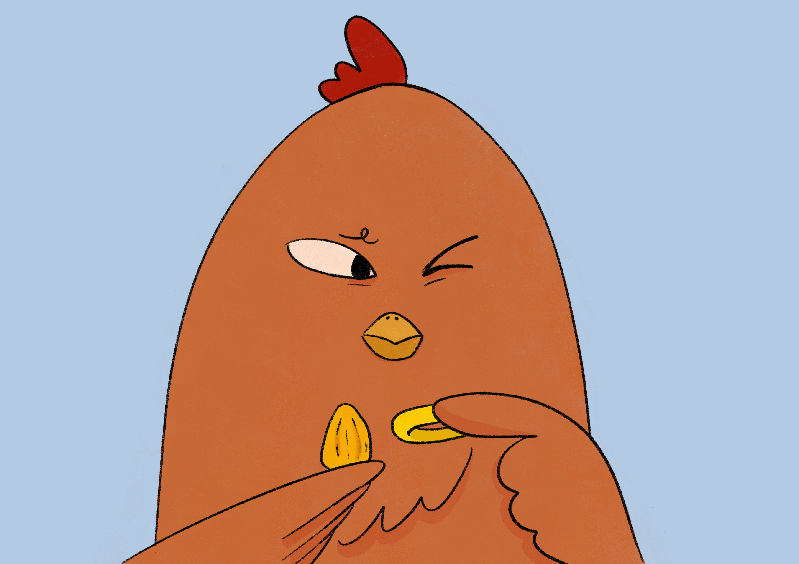
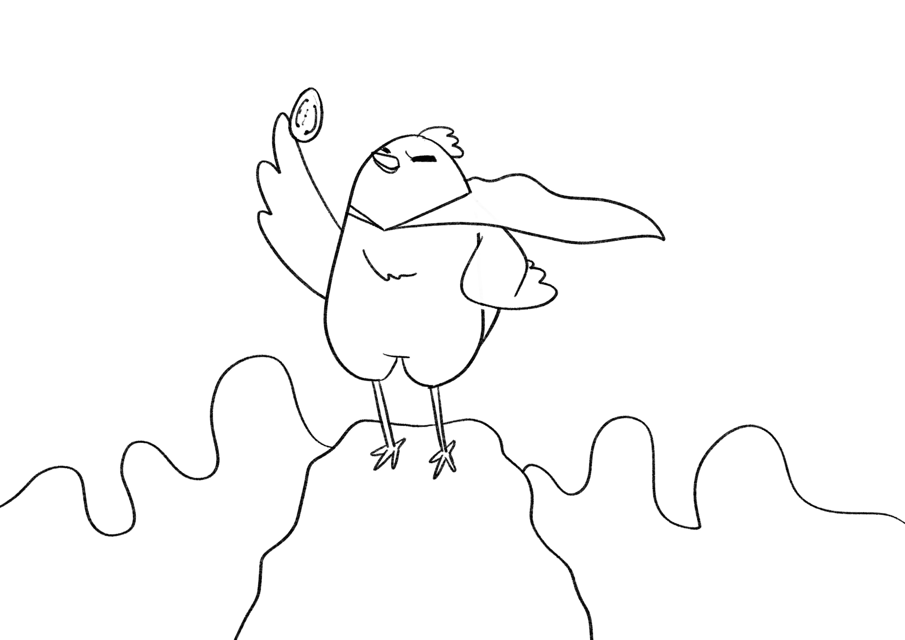
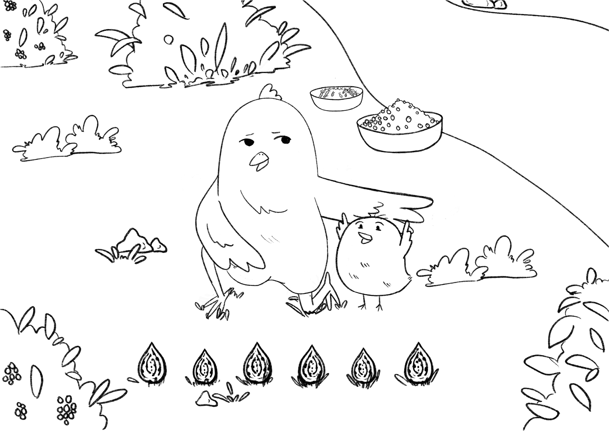
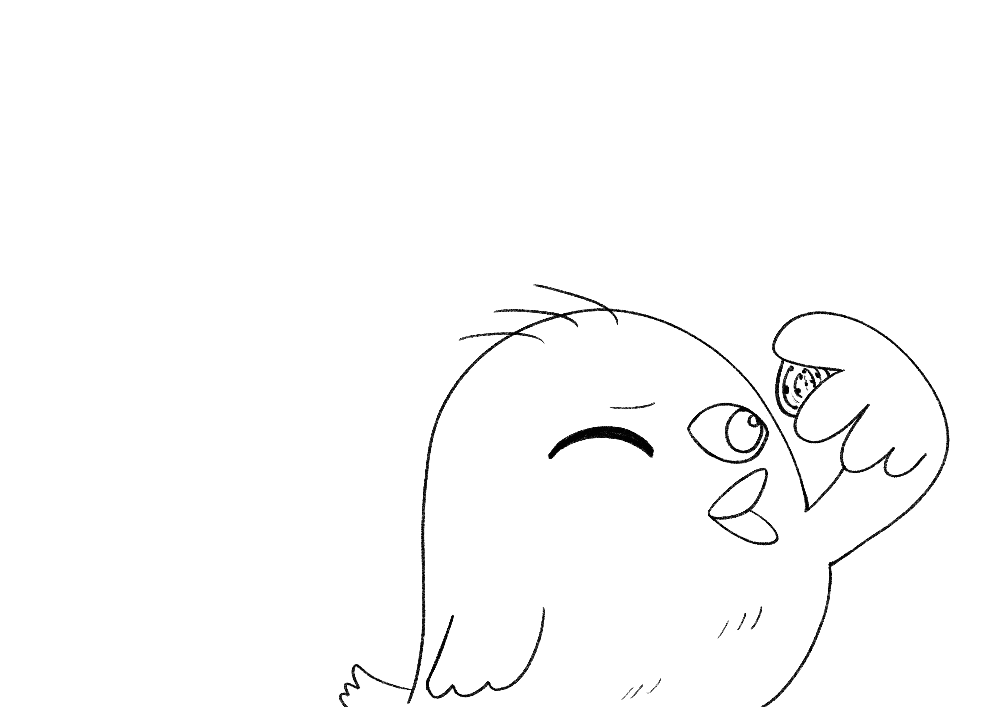
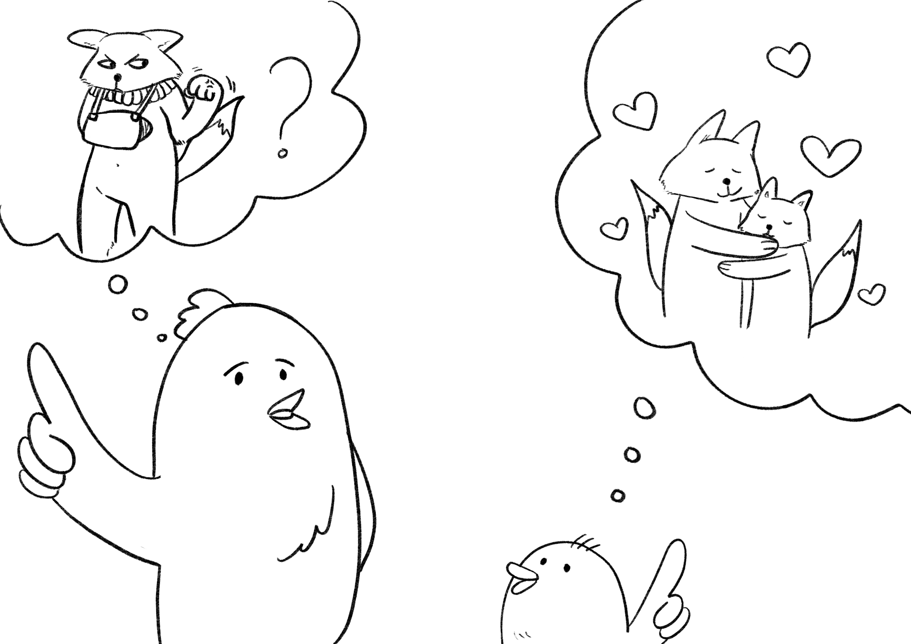
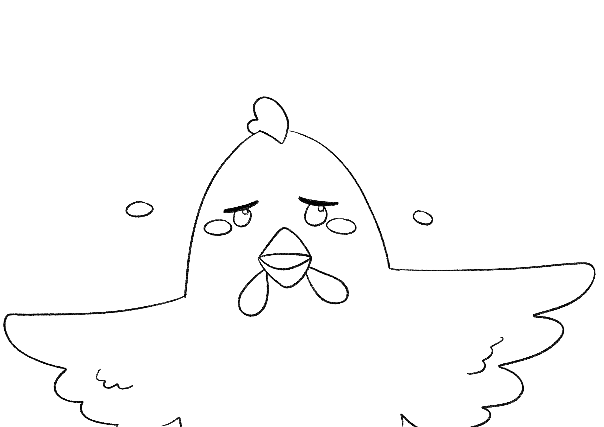
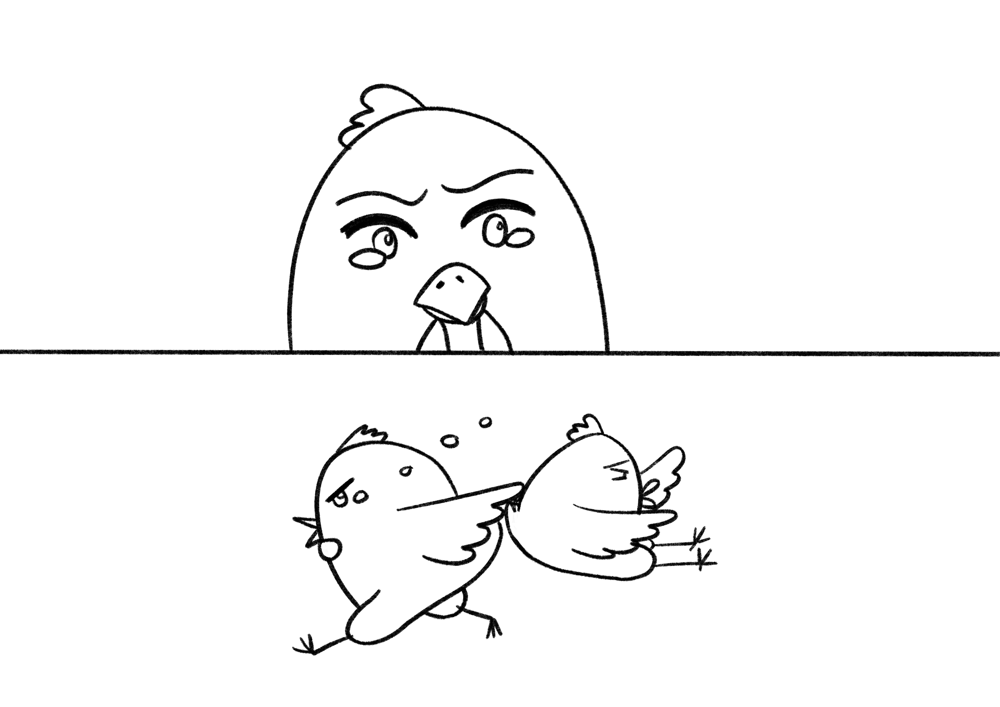
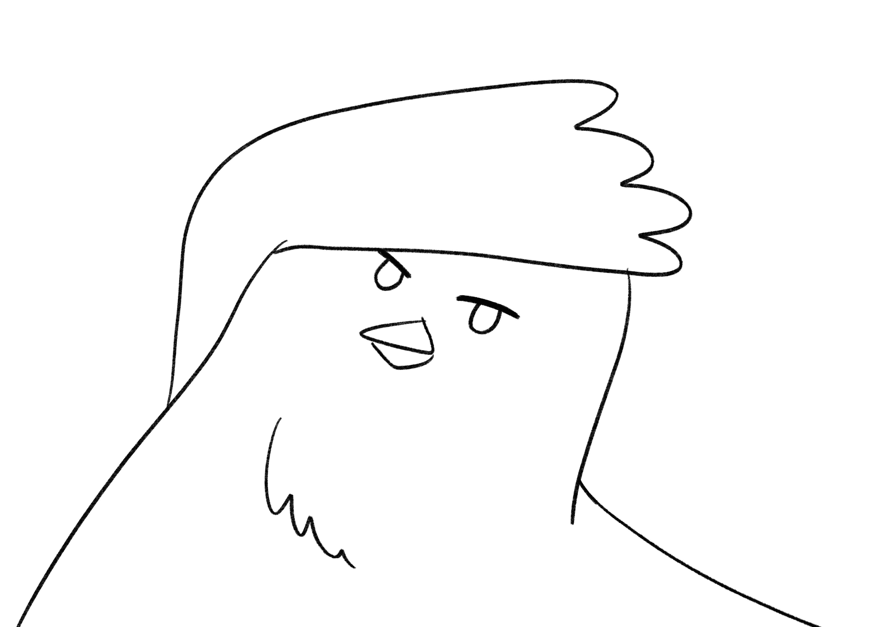
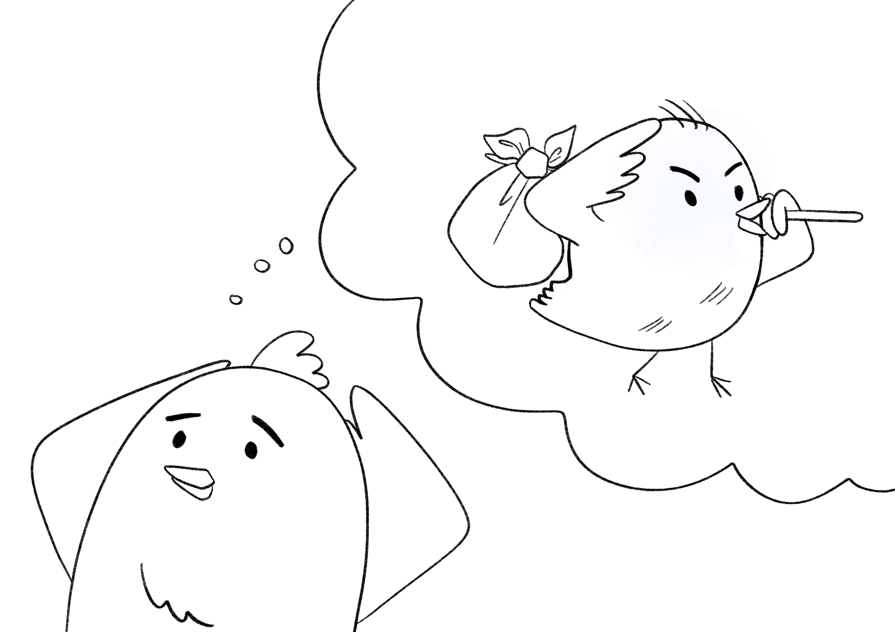
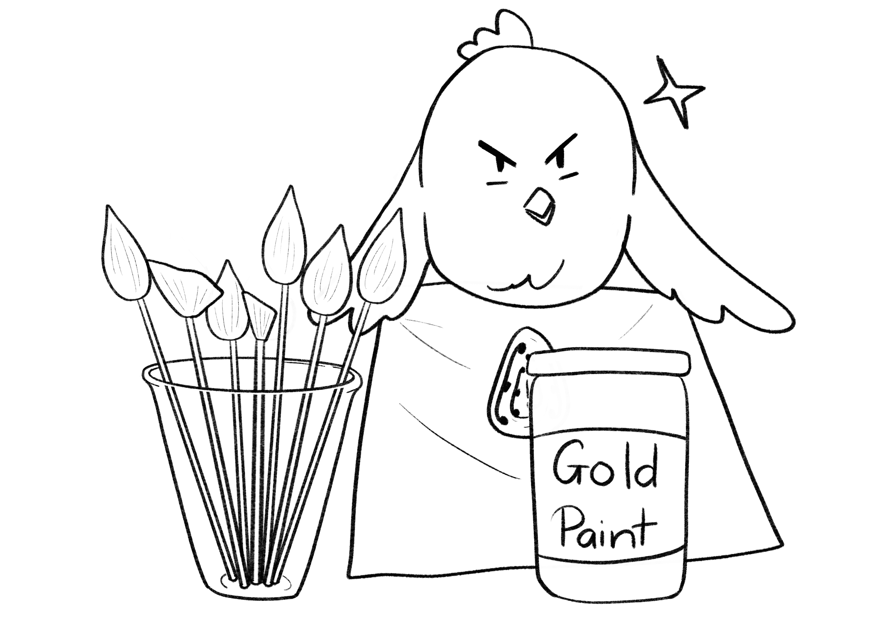

+++
title = "Chapter 1: Pango"
date = 2020-08-20
[extra]
rss_include = true
next = 2
+++

Pango pulled the peach out of the river and prepared to be disappointed by what he found inside. He discarded the fruit because he only cared about the pit. Holding it beside the gold ring he borrowed from his mother’s drawer, he measured its hue. It was useless. The pit of the peach was not made of gold, and he could not defeat the soldiers who held his father with an ordinary fruit seed.

There was a future where Pango got his hands on an enchanted fruit and ate the golden seed inside—assuming eating it was how it worked—and on the other side of that act found a different world, a world without fear. Invulnerable, he would not quiver when a soldier raised his spear in threat. All powerful, he would casually retake Northenden from the party, scattering the mighty red vests into a mess of panic-stricken foxes who happened to be wearing matching outfits. He would liberate his father and Chickpea’s brother from the party prison, and everyone would revere him as a hero. All he had to do was find the path from the present to that future, instead of any of the other futures.

In the present, a bad fall could break Pango’s bones and he wielded only the power of two chicken wings. He had a lot of ground to cover to become invulnerable and all powerful, which made disappointments in these early stages frustrating. If the peach he pulled out of the river had been enchanted and the pit was made of solid gold, Pango would have felt much better. 

Because he suggested the method and was not working alone, each failure, in addition to being frustrating, was also embarrassing. He and Chickpea made an unsparing offering to the river spirit of 70 ripe blueberries and 100 halves of termite before dipping this peach in the river water, but it came out unenchanted just like the ones they had dipped before. It took days to gather each offering, and because Chickpea neither believed in the river spirit nor enjoyed gathering berries and termites, each failed attempt cost Pango some of her patience and made him feel stupid.

Pango lined all the pits up in a row, hoping at least to see some progression from not-gold to gold, some hint of progress. But the newest pit was no more gold than the last.

"Well?" Chickpea asked, too short to see over Pango’s wing, which he had carefully been holding in her line of sight.

"Good news Chickpea! This one is sort of reflective."

Chickpea nudged Pango aside to see for herself. "Which one is it?"

Pango confessed it was the pit on the far right.

She turned it over in her hands. "Reflective means I see myself right? I’m a bird. I’m not seeing a bird."

"It's not much but it's a little more than last time. I think we should try a bigger offering to the river spirit" Pango said. He didn’t think that, but he didn’t want her to say what he knew she was about to say.

"Pango this isn't working. We need to go get the real golden peach pit."

Pango agreed that the enchanted fruit was a nonnegotiable element of any valid plan. There was no hope of simply purchasing passage to Springville and setting up a new life beyond the reach of the party, not unless Chickpea could forget about her brother and Pango could forget about his father. Liberating the party prison was an essential step. But they had time. There was no need for rashness. His problem with the real golden peach pit was that trying to get it was absolutely crazy, unthinkable, and suicidal. It grew only in the garden at the top of Mount Ray, at the southern edge of the world. Mount Ray was too far away, too tall, and he thought the edge of the world was too strange a place to reasonably want to go. Attempting to persuade the river spirit to help was a longshot, he knew that much, but so was attempting to reach Mount Ray, and they had the river right there at home on the island of Northenden. He couldn’t become invincible if he died on an unnecessary hike.

By Chickpea’s account her plan was simple and foolproof and obvious like getting out of bed. The idea came to her the week before, when they didn’t have Pango’s mother’s ring. He happened to have some gold paint, and they tested the gold-ness of each peach pit by dabbing the paint on it. It occurred to Chickpea to paint more than a dab, to paint the whole thing and make a fake golden peach core, and sell it to someone dumb for a lot of real gold. If they managed to sell just one, they could fund an expedition to Mount Ray. The traveling merchants and rich foxes from the south would make their annual trip to Northenden the next Sunday, and as the date approached Chickpea stopped suggesting and began insisting on her plan.

He pointed out that where golden peach pits provided godlike powers and invincibility, fake golden peach pits provide only a few calories and grams of carbohydrates. What were these customers liable to do after they embarrassed or seriously injured themselves? Chickpea casually modified the plan to include only the sale of pits with a golden vein, marketed instead as an aphrodisiac, and considered the issue closed. But the obvious error and quickness with which this plan changed shape did not set Pango at ease.

On his walk home he thought about Chickpea’s idea. She planned no further than getting the money to board a ship south to Springville. To the questions of how they would reach Mount Ray, how the pit actually worked, and how to overthrow the party with it, Chickpea said "We're smart. We'll figure it out." That level of planning would not work for Pango.

Chickpea insisted that Northenden was getting worse for birds by the day. She was possessed by a sense of urgency which instructed her to drag Pango beyond the city walls, through the lion lands, the haunted old marshes, and up Mount Ray, to the end of the world. To him it seemed wholly superior to acquire a golden peach pit here in Northenden and test it and understand it before placing any bets on it. She had never questioned his resolve out loud, but she never respected his prudence out loud either.

When he neared his home he noticed even from a distance that it looked different. His thoughts became quiet as he squinted at the gradually closer picture. On the porch there was his mother, and that was an unusual place to find her, because she feared leaving the safety of home even to check the mail. On one hinge was the door, and that was usually on two hinges. Cracks and holes had been added to the windows.

"Pango!" his mother screamed as she ran toward him and embraced him with both of her wings.

She struggled to acknowledge his questions through her sobs and brief intrusions of panic. His legs could not move fast enough to keep up with her vigorously pushing him toward the house. When he stumbled she kept their pace by lifting him up and he had to kick his legs down in sync to free himself.

Once they were both inside her breath slowed enough for him to catch key phrases and assemble them. Between urgent murmurings of "couldn't find my little Pango", she said "soldiers", "ransacked", and "fox bastards". Soldiers had come and taken what they wanted.

The soldier's cruelty had until then been an outside phenomenon, something that could not take place in his home any more than it could rain in a kitchen. Though it did not inspire him to literally leave the world by its southern edge, he felt his share of the world here had become smaller, and perhaps Chickpea was right that it would continue to shrink if they did not make progress.

If he could never have the magic powers of the enchanted peach, Pango would at least like to have one of the red vests of the party members. Even the soldiers feared the foxes wearing a red vest with white trim. Their word was life and death, and they had no fear of soldiers while out or at home. Unlike his mother, they let their children wander outside, and could focus on whatever tasks they chose with a free mind until their children returned home at a time of the child’s choosing, not agreed upon beforehand. He wondered if they understood the value of their clothing, if they knew how much he would give for the same safety and freedom from fear. He knew they didn’t, but in frustration he still wondered.

"Pango," she said as she contorted her face into a familiar expression of despair and gripped both of his shoulders, "they took the ring your father gave me." Then her grip weakened and she covered her face with her wings again. "As if taking your father himself was not enough."

"No, I have the ring" he said without forethought and held it out for her to see.

Her eyes fixated on it and she did not move. Pango realized he had made a mistake. He should have explained that he took it from the house, because the fear that was now overtaking her would leave no room for him to explain that he had not gone out in search of the soldiers, that he had not, upon finding them, risked death by stealing the ring back from them, or trying to start a fight, or accusing them of theft and attempting to negotiate, earning himself recognition and the further dangers that implied.

One moment she was still. Then Pango was moved across the house by a rabid almost impersonal force and thrown into his room and he heard his mother propping a chair against the doorknob on the other side so that he could not escape.

The ritual began. She would not let him out until her fear receded, which would take days. Through the garden window she would deliver meals three times a day and make light chitchat which he reluctantly indulged because he thought it calmed her and earned him an early release.

The meals would come at precise times, never late or early by a minute. Breakfast came at 8 AM, lunch at 12 PM, dinner at 6 PM. His mother had spent more time looking at a clock than any other thing in life, and it was only within specific pre-negotiated slices of the clock that Pango experienced freedom. Returning at 5:02 PM when he had promised to return at 5 PM did not make Pango late. It made Pango dead. His mother preferred that he was not dead so he tried his best to stay alive. On her confident days she permitted him to venture all the way out to the river a few blocks west. He spent the other days locked in his room, a safe bubble for a fragile chicken in a dangerous world.

Where other children explored and memorized the terrain of Northenden, rushing through the forest playing soldier and freedom fighter, Pango spent his youth laying on the floor in his room and studying the terrain-like surface of the cracking ceiling paint overhead. A large mountain range split the terrain in half. Pango called it the Middle Mountain Range and it was created by rainwater leaking through the roof and weighing down the paint but not breaking it. In his world the force of water caused terrain to rise and erupt instead of erode. He imagined that outside somewhere there must be deep ravines carved out by running water, much deeper than the water running through them. He craved to walk through one so deep that the top could not be seen from the ground.

Unpredictable anxieties in his mother made it impossible for him to predict which days he would have freedom to leave home. Without the ability to make or keep plans, there was no chance of making friends other than Chickpea. She spent her afternoons flying aimlessly above Northenden, and from her bird’s eye view she could see when Pango was at the river. Some afternoons when he wasn’t allowed to leave, he would go to the window and try to wave at Chickpea in the sky. He wanted to tell her he wouldn’t be able to make it and that she could stop waiting for him. But he knew she could not see through his window from her flying height.

If he asked she would say she just liked to fly, but when Pango arrived at the river for the first time in many days the first thing he did was apologize until Chickpea made him stop. Except for Chickpea, Pango was alone. If all those blueberries and half termites could not sway the river spirit, it would probably never come around. Chickpea knew Pango had no more plans to try. If he didn’t help her she would run her scam and venture out alone.

But if he helped and they made money, he could buy books, and maybe learn another way to make a golden peach pit without leaving Northenden. Pango sat at his desk and set out the jar of gold paint, his brushes, the peach pits, and turned on his lamp. He began a long night of work.

