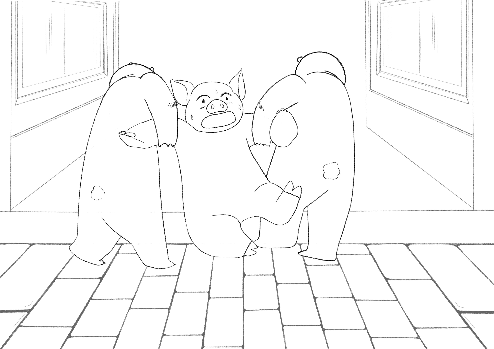
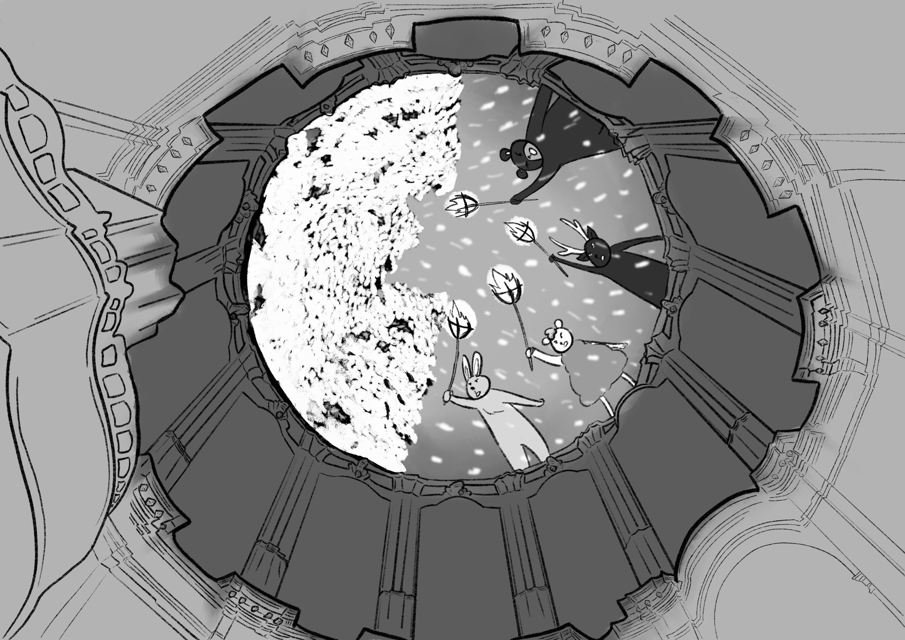
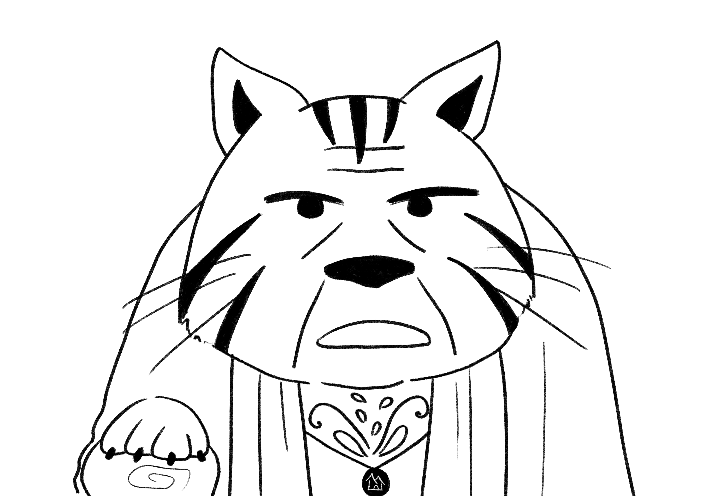
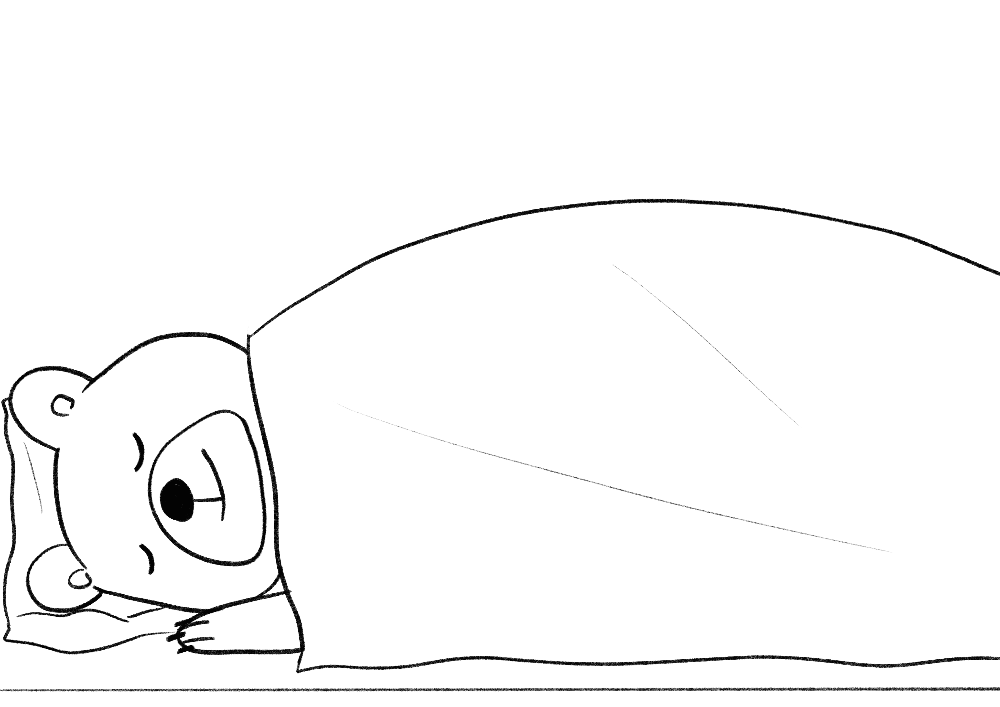

+++
title = "Chapter 2: Plum"
[extra]
prev = 1
next = 3
+++

Plum Piquet was a loyal bear, and he thirsted for one of the white robes of the Beacons so that everyone else would know it too. When that morning Barry Metche confessed to looking at the illustrations in a book, Plum glared at him so that anyone who happened to look would see Plum’s indignant anger at such disrespect to The Academy. But Barry was a botanist, and when they dragged him out of the hall for his sin, the candidate pool shrunk by one. Plum appreciated that, privately.

Beacon Gin was leading the appointment ceremony, which progressed from one tediously intricate traditional rite to the next at the pace of a lame tortoise, the kind of pace which, for those participating without an active role, made paying attention from beginning to end impossible, and lent a rare opportunity for one to get in touch with the more subtle recesses of their proprioception. It began in early morning with the ostensible purpose of naming five students who would embark into the realms, on the first of a career of missions which, if fruitful and honorable, would earn them the status of Beacon. Plum had probably daydreamed about this moment, if the duration of each daydream throughout his 18 years at The Academy were summed up, for longer than the ceremony itself would actually last, but his daydreams only featured the interesting moments, where the Beacon walked stoically through the rows and columns of students standing at attention, to approach and challenge the ones they deemed worthy of the long trials in the realms. These moments came every hour or so. Three of the chairs on stage for selected students had been filled. In the intervening time, Plum idled in his mind and became unwillingly aware of new itches, locales of problematic muscle tightness, a nonspecific sensation in his calves which may or may not be a product of circulatory activity (he did not know if veins and arteries were innervated), and the general complexity of maintaining upright posture.

When the headmaster announced that Beacon Gin would then select the botanist, the fourth of the five specialties eligible for the trials in the realms, the specialty to which Plum had devoted his entire life, Plum returned his attention to the ceremony. The adrenaline made him forget the weight of his shoulders and upper back. He fixed his at-attention posture, and resisted the (very strong) temptation to deviate from the expected forward stare to watch Beacon Gin as he wandered through the grid of students. Memories of his studies played in his mind's eye, including some distant ones from his youth, in chronological sequence, composing a private and emotional picture autobiography of the plot of his life. This limited-scope narrative, which Plum constructed for the purposes of amplifying his anxiety over his imminent selection or non-selection as a botanist, began in the Blessed Garden, where Plum, at the tender age of three, became entranced by the quadriceps vines. Beacon Barley told him that if he looked closely, they had a pulse, just like his own quadriceps. When Plum saw it not only pulse but also flexed sometimes, Beacon Barley didn't believe him, which little Plum made a stink about, loudly and indignantly pointing at the vine, which he could clearly see was pulsing and flexing, and reminding Beacon Barley that he just not two moments before explained quadriceps vines behave like his own quadriceps, and his own quadriceps flexed. Finally Plum got the old bear to put on some glasses and take a look, and then it was his turn to forfeit anything resembling a controlled manner. He rushed out of the garden and brought back with him four other Beacons, each of which looked at the vine, and then back at Plum, back-and-forth with this incredulous expression that drove little Plum into the fits of self-satisfied roll-on-the-floor laughter only available to a young child who has proved an elder wrong. More and more Beacons came, amazed, for reasons Plum still did not understand, that they could still observe the phenomenon in the vines with all of them in the room together. When their reaction matured out of the denial phase, they turned their attention to Plum, and praised him, showering him with more positive attention, affirmation, and validation that he would ever have thought to ask for. It was all for just seeing it, which still confused him, because Beacon Barley had been hanging out in the Blessed Garden babysitting little toddler bears for years, eagerly telling them to look at vines for their pulse, sometimes more than once, like a man armed with a new factoid on the lookout for anyone who might be impressed by their possession of the new factoid. Probabilistically someone else should have seen the vines flexing long ago, but these doubts only came in retrospect. At the time, all little Plum knew was that he ought to hang around the plants. People paid a lot of attention to him when he hung around plants and saw them doing things that other people apparently couldn't see even though they were pretty obvious, and he liked the attention, so he kept hanging around plants. That's how it all started, a lifelong devotion to looking at plants and seeing them do things. And now, Beacon Gin would tell him if all of it added up to enough.

Plum, being a bear, had no skill for echolocation, but from his forward stare the only indication of Beacon Gin's position was the echoing of his cane as it impacted the marble floor before each of his labored steps, so he tried anyway. It felt like they were getting louder, and in his mentally-constructed model of the rotunda's great hall, Beacon Gin waddled toward him, resting on his twisted oakwood cane for a moment whenever he caught up with it, almost gratuitous in his slowness. The acoustics of the great hall complicated his modeling. Each impact echoed through the great hall, off the white brick walls around the rotunda, up the pillars rising from the floor, ascending until they hit the painted dome separating The Academy from Heaven, and sometimes he mixed up an echo with the real thing.

“Plum,” Beacon Gin said softly, just behind him.

Providence. He was chosen. The next question was only a formality, as meaningless in the process as any one of the 18 steps it would take to reach the stage, or any of the muscle contractions his central nervous system would coordinate to lower himself into the fourth chair. The doubt in his mind over the past few moments had been performative, an accommodation for God, who, though She never seemed to leave the sacred chambers in which She lived above the painted dome, pulled most of the important strings at The Academy, and had opinions about unrepentant pride even if it was indulged only in thought. Plum's place, he always at some level knew, was in the Beacon's quarters at the top residential level of the rotunda. His true outfit was the white robe of the Beacons, social evidence that he was a signal of God's light, a tool of strategic value in Her campaign to reunite the world which had been shattered into realms, to tear down the realm barriers which divine light could not cross. Plum did not feel entitled to this in a comparative way. It was not because he thought he was better or more deserving than other students. He felt it because the Beacons loved him his whole life, and he loved them too, and so how could they treat him any differently?

“Yes, Beacon Gin?”

“What season is it?”

“It always has been and always will be the third winter.”

“You will leave tomorrow morning and find a field sown with muscle vines. Watch them grow in one week. Take your place in the botanist’s chair.”

In his dorm that night, Plum crawled into bed between clean sheets and the screams from the library did not disturb his peace. Often they did, because he worried he might be locked in the library screaming himself one day. But that night was his last night in The Academy as a green and naïve student. Tomorrow, he would venture into the realms God had created in the unified age, and realize Her will upon them. After his return his bedroom door would open to the balcony walkway around the circumference of the great hall. In the mornings he would look up and see the Founders on the painted dome, and from that height the screams from the library would be unable to reach him. With everything he had ever dreamed of, books would not tempt him.

