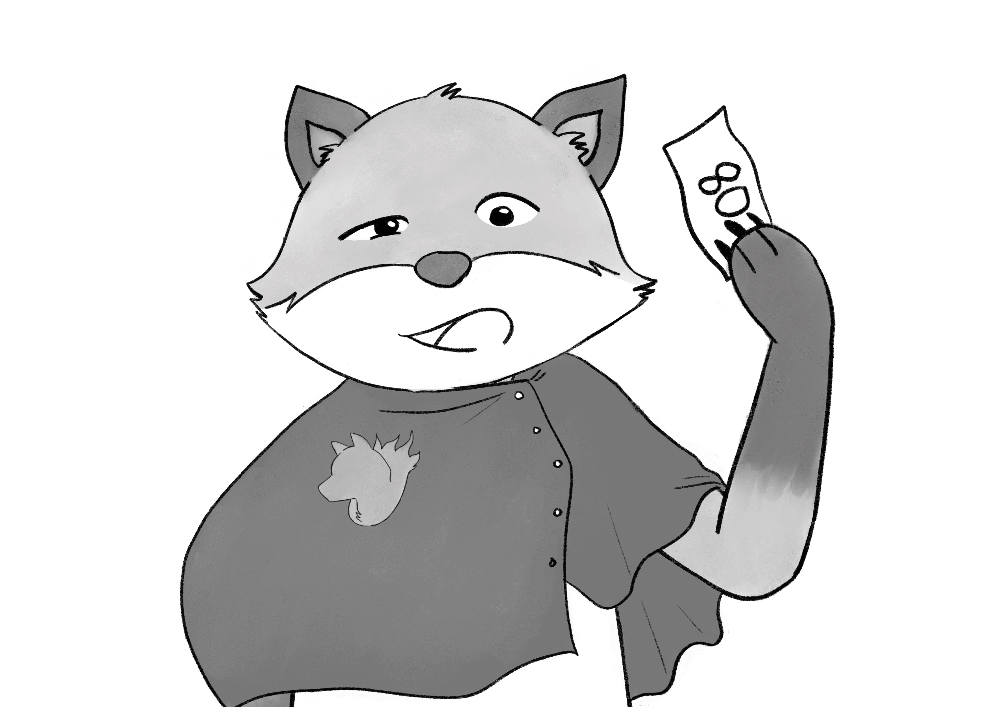
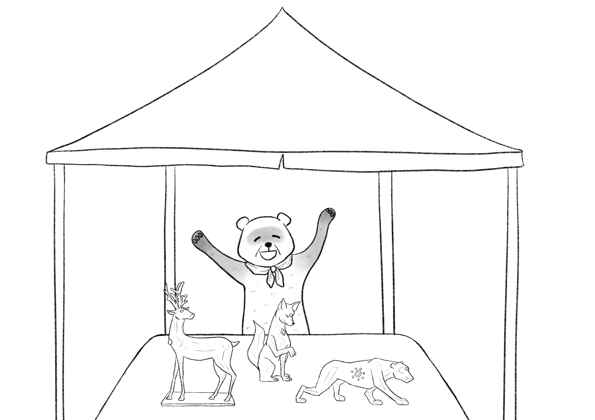
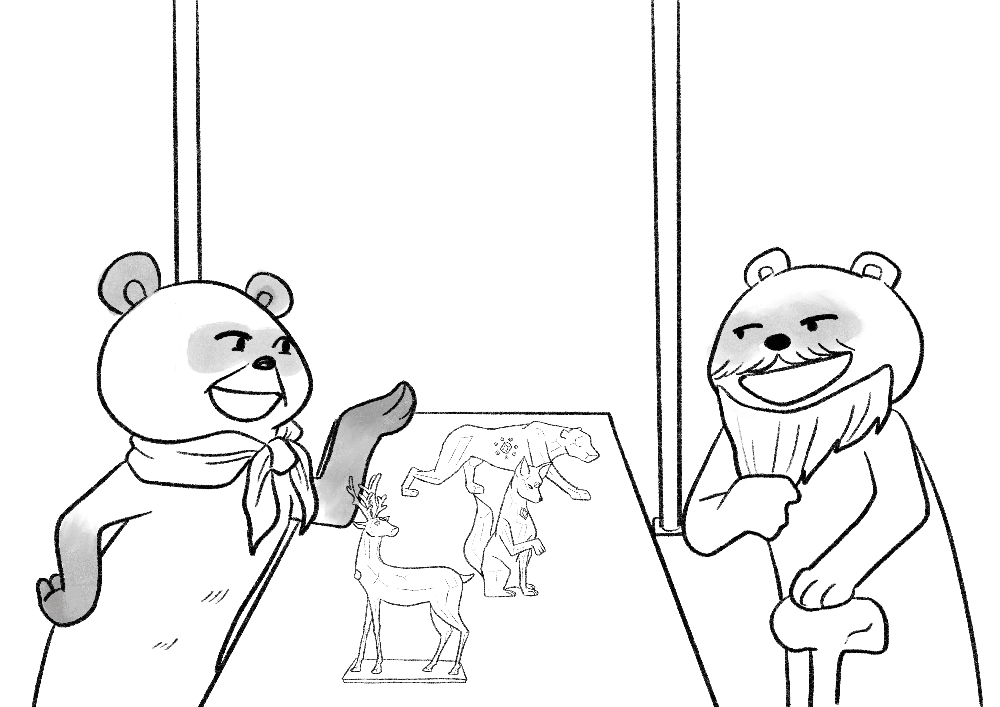
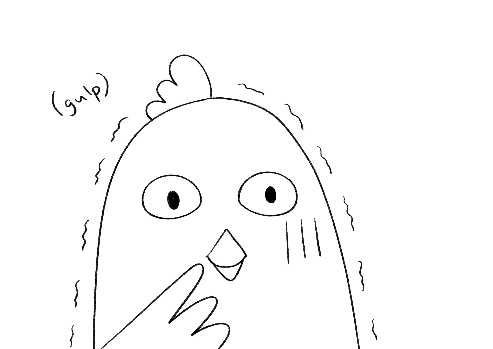
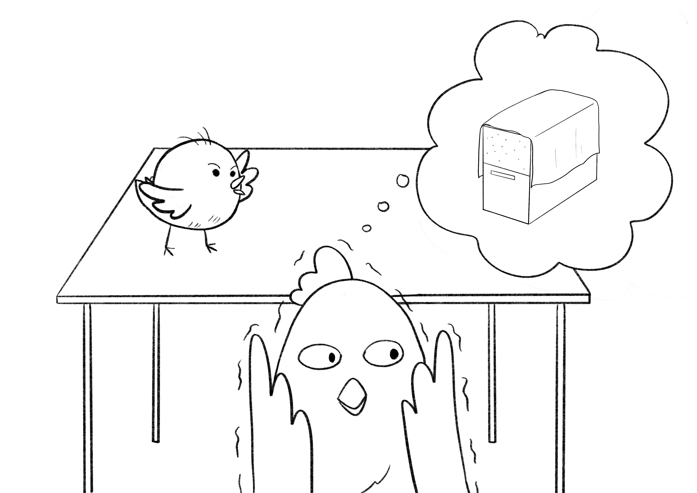
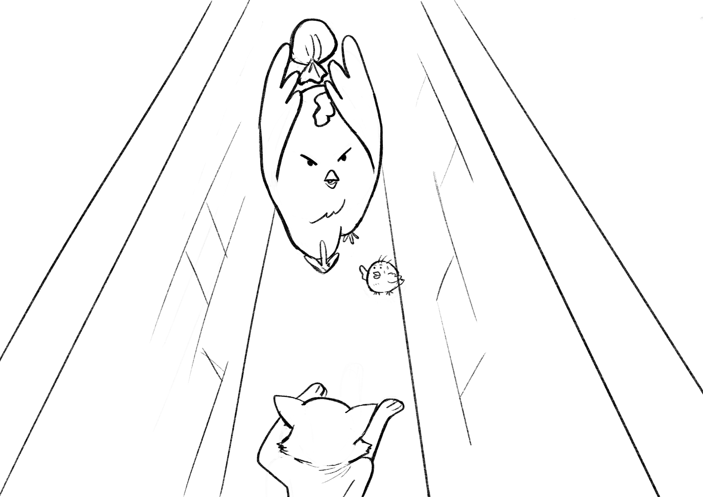
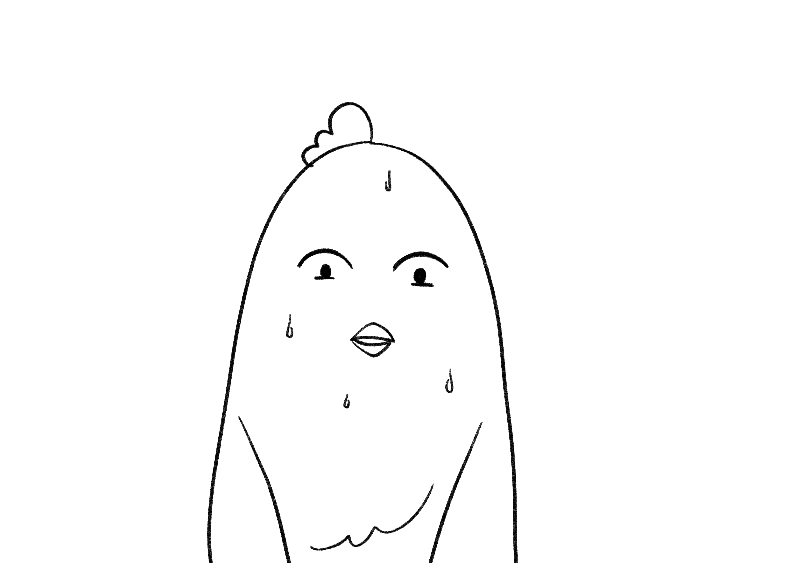
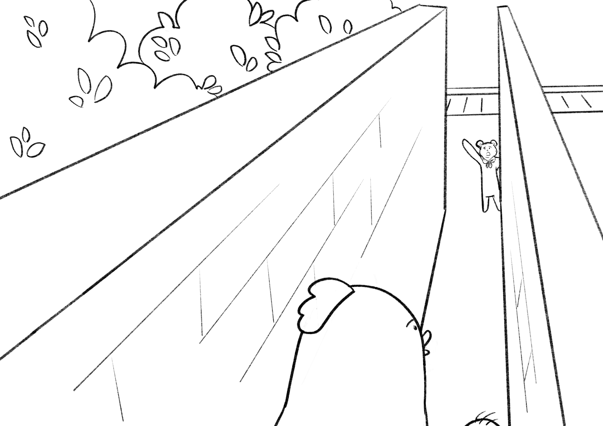
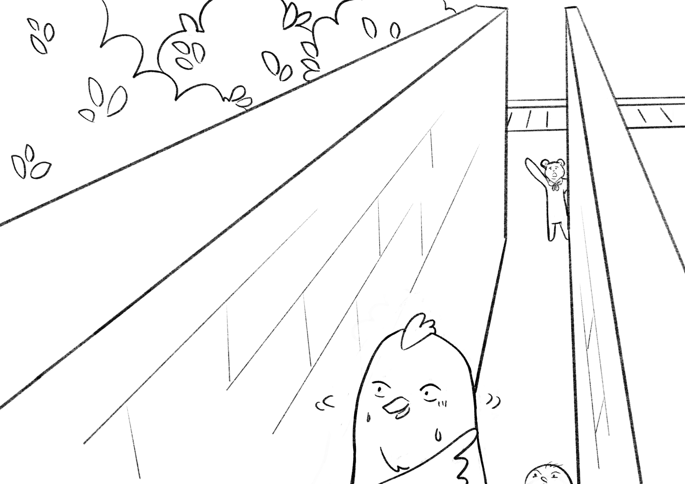
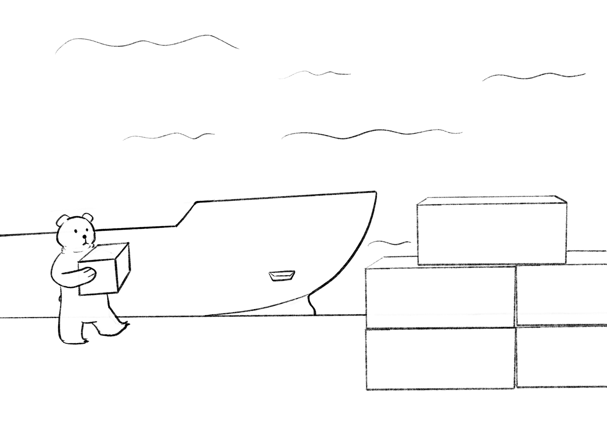

+++
title = "Chapter 3: Pango"
[extra]
prev = 2
+++

The book “An Enchanted Fruit of Your Own”, authored by a renowned botanist from a university in Chenowth named Nadia Gombo, cost the same amount of gold as a single bird’s passage off of the island of Northenden. According to the catalogue Pango circled it in, the book instructed readers on how to grow enchanted fruits right at home. That was perfect because home is where Pango preferred to remain.

As he climbed out of the window, he pictured himself picking an enchanted peach off a tree grown in the safety of his room. Whether it was practical to grow a peach tree inside his house, he didn’t know, but he tried to focus on the possible positive outcomes of his decision now that he had made it and would not turn back. He stayed low as he snuck around the back of the house, so his mother would not see him, and then rushed to meet Chickpea at the market.

Pango’s calculations were thorough and he believed this risk was necessary. Helping Chickpea run her scam would earn him some influence over the money, with which he could persuade her to order a copy of “An Enchanted Fruit of Your Own” and the materials it required instead of purchasing passage off the island. If Chickpea left on her own, he would still need the gold to buy the book, and there was no way for a bird to legitimately earn gold in Northenden. If he ran this scam with her, Chickpea might stay safe on an island she knew well instead of facing trials only the gods know to reach the southern end of the world.

But when he arrived at the market, these conclusions fled him and he tried unsuccessfully to recall the logical steps he took to reach them the first time, so he could walk them again. In the place of his resolve, he imagined his mother scolding him, comparing him to his father, and he felt ashamed. She had already lost her husband to idealism, to ambition. How could Pango rob her of her son? He should know better. Did he really think a book anyone could order out of a catalogue would solve a problem for all of Northenden? He should keep his head down and focus on things in his control, which did not include politics.

He checked the clocktower every few minutes. Assuming his mother did not stop by his room and ask him a question through the door before she delivered lunch at 12 PM, he had 2 hours and 45 minutes before she realized his room was empty. This could not be allowed to happen.

Chickpea pecked at his head. “It’s us!”

Beyond the crowd in front of them, beside a tall stack of wooden tables, a soldier yelled “80!” over and over again. Pango pushed through the crowd, steering through other chickens so as not to bump any foxes.

“You have area 80. Will you rent a table?” the fox said when he read their papers.

“No, we don’t have any money,” Pango said.

“You can pay after, for double price.”

Pango wanted to check the clock tower again, and debt to the party did not excite him. But Chickpea said “We’ll take one.” She whispered to Pango that it was essential they look professional while selling fake merchandise.

When the fox lowered the papers and looked down at his new lendees, Pango felt afraid. He had never been so close to a soldier before. The fox’s spear was three times taller than Pango, as thick as his neck, and capped by a black stone chiseled into a skewed raindrop so it could rupture the skin and invade flesh. He would not dare play fickle, so he let Chickpea’s ill-thought purchase stand.

The table weighed much more than Pango. And Chickpea was of course too small to help when it came to moving the thing. Even pulling it on a wheeled cart gave him frightening thoughts of his hollow fowl bones cracking and bending in two. He collapsed under the shade of the table when he finally arrived in area 80, and rested until he stopped wheezing.

When he regained his breath and sat up to check the clock tower, he suffered a grave realization. He checked left and right and did not see it. Wincing, he tilted his head straight up, at the unreadable thin underside of the clock. Area 80 was located directly beneath it. Now he could not check the time, and thanks to Chickpea any attempt to rush home would first be delayed by a grueling trip to return the table.

Pango took stock of their neighbors. Across the street, an old ferret sold copper sculptures with embedded gemstones. She had a sign that read “Forms by Diane”. To their left and right, chicken families sold harvests of beets and potatoes. Honest products surrounded their booth, and Pango felt he and Chickpea were too obvious among them. At least one soldier paced by at all times, and Pango feared that if one caught on and accused them of running a scam, even these soldier-loathing chickens would look down on them for their dishonesty.

Diane gave each child in a group of little foxes a handle to hold up and told them to run. As they did, a puppet expanded into a large snake which appeared to slither along above their heads. It was cute, and innocent, and when Pango looked down at the peach pits he had painted with a golden vein sitting on their table, he wanted to hide his sins. He buried his head in his wings on the table.

“You’re going to scare off customers if you sleep there, Pango.”

Chickpea was right. Pango left the booth to her and crossed the street for a view of the clocktower. It was 10:10 AM. Less than two hours remained before he had to be home. He looked hopefully at passing foxes, picking out the ones wearing jewelry, and prayed they would stop and talk to Chickpea so she could nab their gold and he could go on home, but five of them passed without even looking.

The spot he chose to stand for his view of the clock tower was too close to Diane’s booth. Diane had taken a pause in her conversation with a customer and was looking at him. He knew he had to look away. He knew he had to break her eye contact before she decided that his cataleptic reaction betrayed guilt. He thought of prison, and tried to remember what they did with thieves. No, it was not the time to be browsing memories. He had to look away, look away at anything.

Her crate. The first thing Pango looked at when he looked away was her merchandise crate, possibly the worst choice. He cringed, but when he smiled at Diane and pretended to look with interest at her sculptures, she resumed her conversation.

"He is very handsome, very very handsome," she was telling her customer, who was also an old ferret, with passion. "He can speak all three tongues, and he invested in the Pale Ox mining company well before they found mithril. Now he owns land outside Springville, with plenty of room for a wife and children. Many children!"

The customer let out a nose-exhale kind of laugh and played with his beard. "That's a strong case, but I fear I've spent all of my granddaughter's patience for my recommendations. She would rather travel than marry at this age" he said, before shyly mumbling off "I'm particularly interested in this tree sculpture of yours, maybe you could tell me something about — "

"Going to Palestan is travel! I'm going back tonight." She put her paw on top of his. "I've got two rooms on the ship. Your granddaughter can take one, and we can share the other."

Pango decided that was a good time to walk away. He sat down in area 80 behind their table to think while Chickpea hopped around enticing customers. What did they do with fraudsters? He knew about the prisons only what his mother had told him. They handled birds in two ways. For some crimes, a bird was thrown into the cage, a giant network of caves with all of the openings covered in metal grates. This was bad, but not a horror. Most of the birds in the cage were imprisoned for crimes as simple as looking at a soldier without the proper amount of respect. The prisoners were soft, and they were fed. There was no freedom, or sunlight, but because he was presently committing a crime Pango focused on the tolerable aspects. For other crimes a bird was noosed. Pango wracked his brain to recall which of these two punishments the party applied to fraudsters.

A fox approached their table and Chickpea was talking to him. Pango tuned in because he thought the fox sounded suspiciously young.

"Let me make sure I understand, because our product doesn't work in all situations. You love this girl? You think you're right for her?"

"Yes, yes."

"But this love is one-sided?"

"Well, I think she knows that I'm right for her, she's just tied up in something right now. We used to hang out all the time but we barely do anymore since she got this boyfriend. No one really likes the guy. I have no idea how he pulled the wool over her eyes, but he's got her trapped in something thick. On the rare occasions that we do hang out, all she wants to do is talk about him —”

“Okay —”

“— which is so frustrating because I'm right there and clearly —"

"Okay, I understand. What's your name?"

"Peter."

"You have a great name, Peter. My name is Angela," Chickpea said. "Now listen Peter, you're lucky because we do have what you need. Any peach core that's gold has some magic, but you have to pay attention to the pattern because that tells you what kind of magic. This one here is the one you need.

"On the day you feel most brave, you'll eat this. Then the first person that you confess your love for that day will fall in love with you. But remember: you have to do it the same day that you eat it and it will only work if you are truly in love."

"Oh, I am truly in love. I know it."

"Then I wish you and your future wife many happy days."

That is how their empty pouch became a pouch full of more gold than either of them had ever seen in their life.  Pango stood up behind Chickpea to see the end of the transaction for himself. The fox slid gold coins into the pouch that Chickpea held open with her beak. The duped fox had not walked away yet, so Pango had to abstain from looking in the pouch and staring at the sparkles from the sunlight reflecting off of the coins, reaching into the pouch and feeling the cold metal shape around his fingers like liquid as he dragged his wing through the coins, and also from running away as fast as possible to bury the coins, so as not to create suspicion.

Once he got over the shock of owning gold for the first time, Pango wondered why a young fox had so much to spend. A fox Peter’s age could not earn his own gold. He must belong to a family with gratuitous wealth if his parents provided him such an allowance, and only members of the party could become so rich...

Pango lifted his eyes to look at Peter again. An older fox wearing a red vest with white trim guided Peter away with a hand on his shoulder. They left the gold, but the older fox was looking back, at Pango, straight into his eyes. Coming here was a mistake. Years of hesitation and careful planning blew away in the wind. Was Pango so stupid? Obscurity had been his only shield in this world, and now he had come to the attention of the party.

“He knows and he saw me.”

“Don’t worry Pango. Foxes can’t tell chickens apart,” Chickpea said.

“No, he saw me. We have to go home and warn my mother.”

“If he can really recognize you, and he can’t, going home would just lead him to your mother. Just wait. They’re not going to arrest us here. It’s bad press.” Chickpea said this with half her attention as she nudged the pouch of gold coins off the table and hid it under pine needles on the ground. 

He tried to distract himself while he waited for the crowd to leave by watching other booths, but images of soldiers taking his mother intruded on his mind. How Chickpea managed to stay calm and seduce customers under these conditions escaped his understanding, but she at least agreed not to sell to any more foxes. 

Diane stared at them whenever she wasn’t occupied with a customer or the old ferret she had been flirting with, who stopped by her booth every half hour. Pango overheard that his name was Eddard. After Diane pointed Pango out to Eddard, Eddard began staring at him too sometimes. What were they saying? It frustrated Pango to not know. He wanted to make them explain.

A large crate behind Diane’s booth drew his attention, and he pretended to be checking out a booth beside hers to get a better look at it. It was far larger than it needed to be to fit her merchandise inside. He knew it wasn’t full in the morning because he had not seen her sell any sculptures. A horizontal divider separated two compartments, and the top compartment had holes in the sides. Air holes.

When he saw the holes he bolted back to area 80 and hid behind the table. Diane wasn’t here to sell sculptures. She was here to kidnap birds.

“She’s going to kidnap us.”

“The ferret? Would you relax, Pango?”

He’d like to. But he would not. It must have been at least half an hour after lunchtime now. His mother would be worried. Though it would be of no help, he wanted to know the time, so he walked out for a view of the clocktower taking care to avoid Diane’s booth. It was 12:40 PM, so his mother had been suffering for 40 minutes.

Then he heard his mother scream.

How could she be there? His mother would never venture so far from home as the market.

When she screamed again Pango felt his chest tighten and constrict his heart. A tingling sensation emerged in the tips of his fingers, making them stiff and less responsive. He ran through the crowd toward the sound, oblivious to who he was pushing out of the way. Finally he made it to the source, area 80, but he did not see Chickpea at the table. Another scream came from an alley behind the clocktower. He followed the echoes of the scream into the alley.

A surreal scene unfolded before him when he rounded the corner. The red vest, Peter’s father, walked ahead of two soldiers. One of the soldiers dragged his mother by a rope they had bound her in. The other soldier, fallen behind by a few meters, jabbed at Chickpea with his spear.

Chickpea dove in, beak first, for his eye. The fox made a shrill sound when it became one-eyed, but neither the red vest nor the other soldier turned to check on him. He removed her with his claw and threw her to the ground, breaking her left wing. He tried to jab Chickpea with his spear again and she struggled to dodge by hopping laterally with a lopsided flap.

The foxes were carrying away his only family and his only friend. He stood paralyzed by an unsolvable problem. If he tried to fight the foxes, he would die. If he tried to rescue them and run, he could only carry Chickpea, and it wouldn't matter anyway because he could not outrun a fox. If he did nothing, he would be alone, guilty, and ashamed. The tightness in his chest progressed, and the tingling sensation from the tips of his fingers crawled up his arms and into his face. A feeling gripped him which must have emerged from deep within his mind, a central primal part which provides the information that precedes thought, because the feeling was not a conscious reaction or process but raw perception, as undeniable as the colors of his vision and the sounds of his hearing, and it was that violence was due. His whole body tensed and he imagined gripping the neck of a soldier and smashing his head into rock repeatedly until the soldier’s only experience was suffering and finally he became inanimate.

Without thought, with an entirely silent mind, Pango sprinted back to the booth and fetched the pouch of gold coins. When he returned to the alley, the foxes carrying away his mother had already turned a corner out of sight. One victim remained and Pango looked only at his victim. He launched the first swing from behind and achieved impact at the top of a beautiful arc. The fox stumbled, and Pango seized the opportunity to pose for a two armed overhead swing. By the time the fox turned around to see Pango the pouch of coins was almost down upon his head.

The fox was an object now. Wheezing sounds escaped from it between the swings Pango brought down upon its neck. There was no objective, there was no context. Pango was not a chicken or anything else and there was nothing outside of this action. To exist was to raise and lower the weight in his hands upon this pathetic disgusting object on the ground with as much force as possible.

Moments after he sat down to rest on completion of his task he was disturbed by a pecking sensation in his feet which had just begun, or at least just come to his attention. Pango looked down to see a small blue bird emoting and yelling something at him.

From a narrow tunnel through which Pango could carry only a single thought, he emerged into his usual awareness. He recognized the bird and in a short, rapid transition what became strange was not the bird requesting his attention, but the memories of the moment before that took place in a foreign state of mind. Chickpea increased her volume as he did not respond.

"PANGO!"

He could not help but fixate on how strange the state of mind he just exited was, how unlike any of his other memories it was, and how because it was unlike any other he did not know where to put it.

"Hi, yes I'm here," he said, from wherever he was.

“We have to run!” Chickpea yelled, hopping and pointing to the end of the alley with her one unbroken wing.

It was Diane. She inched toward them with one palm up and an empty potato sack in the other hand. “Wait!” she said. “I can get you to Springville. Just get in the sack, quick.”

Pango picked up Chickpea and staggered to his feet. The energy to run had not arrived yet.

Chickpea drove her head into Pango’s chest trying to get him to start running. While doing this she yelled out to Diane, “I’ll just buy a ticket, no need to get in a sack.”

“My grandson can help you. He is very kind and has lots of money and many connections.”

“‘What are you talking about? We can just buy tickets to Springville!”

Diane pointed at the dead fox. “That’s a dead fox. You killed that fox right? You can’t buy a ticket.”

“Your crate has air holes, this isn’t improvisation. Pango, MOVE!”

Pango knew he had to put the memory down and stop looking at it. He could tell that staring at it from various angles in exasperation looking for a place to grip it, a way to contextualize it, and integrate it back into his understanding of the world with some consistency, might last forever. So he decided to set it down and look away in just a moment, but the moment kept growing longer and he had to remind himself of his intent to set the memory down many times.

“My grandson said I might need it. He’s very smart like that, and kind, and has lots of —”

“Pango, PLEASE MOVE!”

Spear shafts pounded the stone around the corner, announcing a group of marching soldiers, in the direction opposite Diane. Pango and Chickpea would soon be cornered. Fear of the sound jolted Pango into focus, but too late for any decision making. The arithmetic at this point was simple, but uncomfortable. For murder, the party would kill them. This ferret only might kill them.

When Chickpea heard the noises, she gave up pushing her head into Pango’s chest and hung her head. “Ok, whatever. Do it.”

And they climbed into Diane’s potato sack.

For hours they sat in Diane’s crate and said nothing. Pango used the silence to assess their situation and inspect his mind. It was obvious to him, undeniable, that he was an idiot. Not only had he repeated the mistake of his father, he had outdone it. By Pango’s hand, his mother was not only robbed of her son, but also her freedom. She would serve Pango’s own sentence because Chickpea was right, foxes cannot tell chickens apart. And he still couldn’t remember what the sentence for fraudsters was.

At dusk Pango held Chickpea so the bumps and jolts of Diane wheeling the crate to the dock did not hurt her broken wing. As he held Chickpea in this weakened state, he noticed an inconsistency in himself. Where he could easily see the fault within himself, a simple cause and effect between his crimes and his misfortune, he could not accuse his friend in the same way even when they shared the same crimes and misfortunes. Chickpea only wanted freedom from the party, and for this they shrank her world even further, taking her flight and confining her to the ground.

Then he considered his father, who faced the party without power, knowing that he had no power, and that they would take him away. He had always thought it was condemnable vanity to place the narrative of his life, his reputation for bravery, over his own family. But now Pango was in a crate facing exile or worse, and had gotten his own mother imprisoned, and he wondered if his own optimism was any more respectable than his father’s? Was Pango just as vain, or did his father also think something might have come from his efforts?

“Chickpea, do you remember what the party’s punishment is for fraud?”

She did not respond for a moment, and he could not see her face in the dark of the crate. Eventually she said “the cage. They put fraudsters in the cage.”

At least his mother and father would have one another.

Pango layed down to sleep as the crate was loaded onto a ship out of Northenden.

