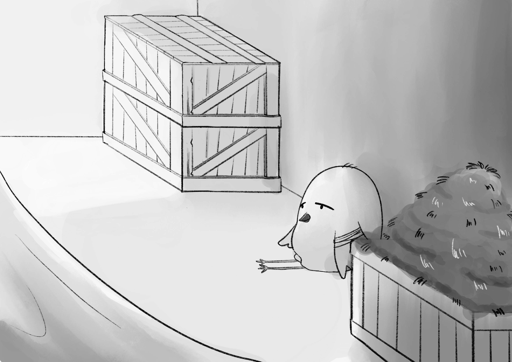
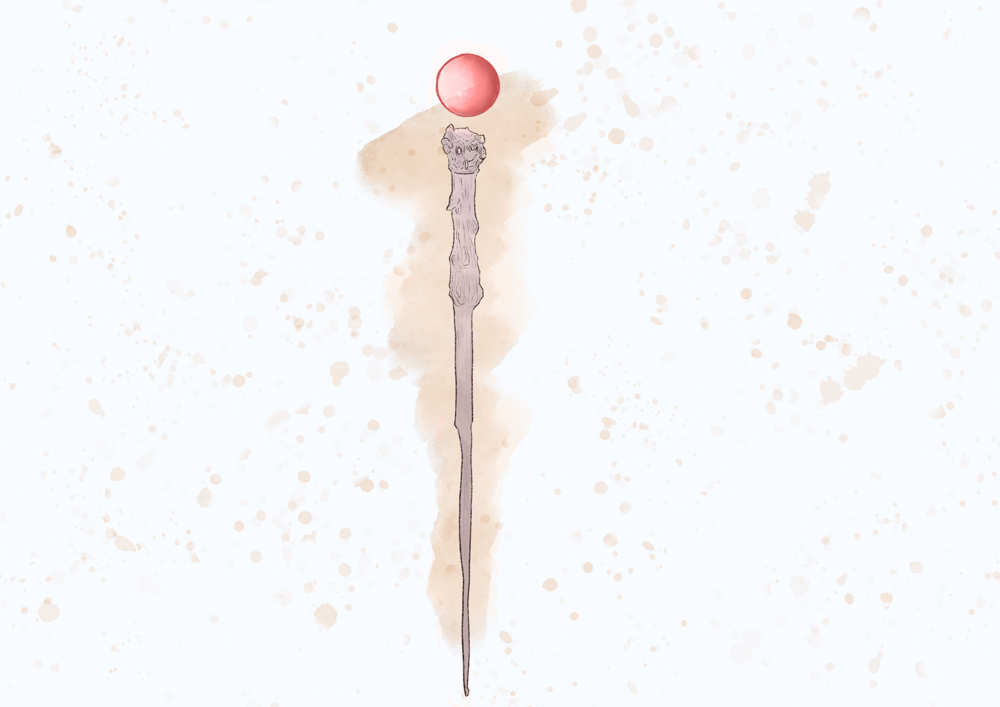
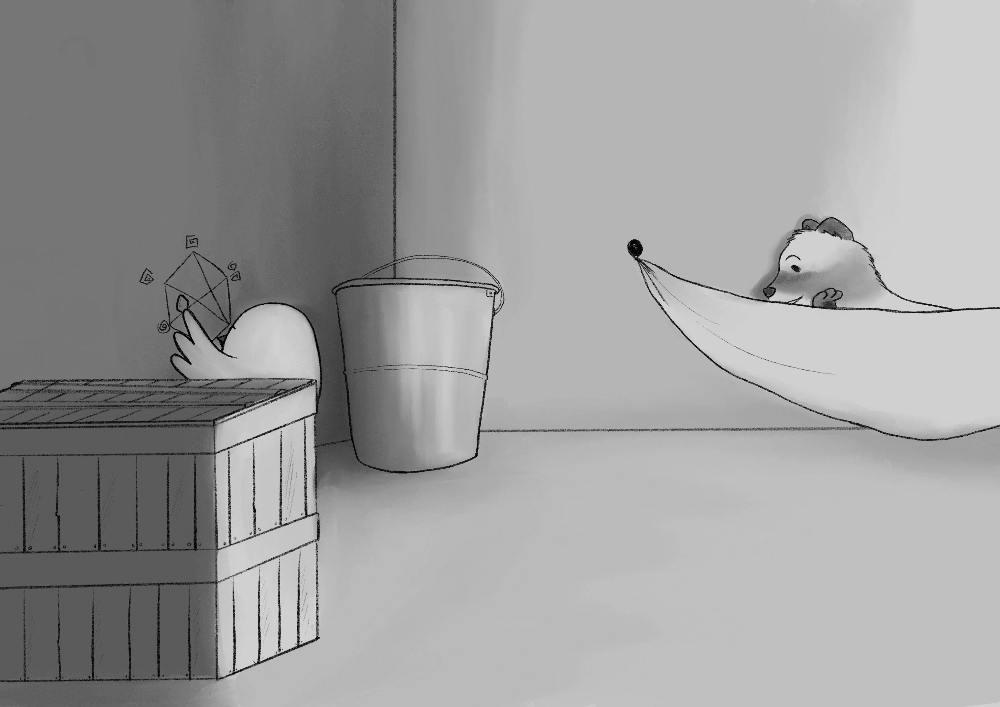

+++
title = "Chapter 4: Chickpea"
date = 2021-01-09
[extra]
rss_include = true
prev = 3
+++

Chickpea and Pango had been on the ship for two days. Chickpea’s wing had not improved. The bone set wrong and every sway of the ship caused it to stab her somewhere inside her wing. She held still and breathed long measured breaths to reduce movement to the minimum. 

So far the ferrets that smuggled them on the ship had not mistreated her or Pango. They were kind, even. Once aboard, Diane let them out of the crate into Nadelle’s cabin. Nadelle was the granddaughter of some customer who Diane had seduced into coming back with her to Springville. Pango reminded Chickpea more than once that his name was Eddard. The third time she only pretended to have forgotten, to annoy him. There was a plan to marry Nadelle to Diane’s grandson, or something like that, but Chickpea had a broken wing to focus on and maintained only a limited awareness of her surroundings and company.

Back in Northenden Chickpea ate breakfast in the early AM, because she had to. As soon as the sun rays poked through the maple leaves she hopped out of her nest and started her warmup exercises, high kicks and winding her wings in large circles. She woke up all at once. There was no easing into it for her. Her nest in the mountain forest was a 15 minute flight from breakfast, in town. If she flapped desperately, she could cover the distance in only 10 minutes. On-time arrival for breakfast was imperative.

When the party disappeared her parents and imprisoned her brother, Chickpea blazed her own trail. In her first days alone, before she understood the role of birds in Northenden, she knocked on the door of James Everett Public Orphanage by biting the door knocker in her beak, flying back, and letting it fall on the door. When a red coated fox answered the door, she asked for room and board and the general help a young and guardianless birdling might expect from a minimally empathetic society. The fox glanced down and then snapped back up and pretended not to have seen Chickpea. His act didn&#8217;t convince her. Even at that time, when she was more forgiving in her reads of others, she found it implausible that someone would miss a bright blue songbird on a sunny day only inches from themselves, even if the glance was short. This fox was playing her. She responded with the indignant stubbornness of a child with disappointed expectations. For days she abused the door&#8217;s knocker, banging it without rhythm, at unpredictable intervals, in her best attempt to torment whoever had denied her what she felt owed. They never answered, and they removed the knocker. Northenden had one orphanage, so with all one of her options exhausted, Chickpea self-sustained in her own way. Her own way consisted mostly of stealing food out of folk&#8217;s hands at the town market and booking it straight upward as fast as she could fly with the loot, plus some more elaborate schemes here and there.

What she could steal from the market&#8212;bites of cinnamon bread or salted pretzels on good days&#8212;it was nothing compared to her breakfast arrangement. Her breakfast arrived at #3 Claw Street at a specific time every morning, just a few minutes after dawn. An elderly fox with both feet in the grave, sort of sitting at the grave&#8217;s edge with both feet in and just testing the water, lived alone at #3 Claw Street. As far as Chickpea could tell, she did nothing at all. She never left the house and no one ever came to visit. Chickpea flew over that street every day on the way to the market, and over time acquainted herself with the tops of the heads of at least one resident from every home except #3. Curious, she flew down to a window and peered inside and found an old fox splayed out on a reclining chair, eyes open, staring at the ceiling. Her chest moved, so she was still breathing. Somehow this fox was getting food without leaving her home. Chickpea staked the place out, which the house readily accommodated because the unrepaired holes in the roof were big enough for her to infiltrate the attic. Just after dawn, two red coats delivered a fresh meal in a box. The aroma rose up to Chickpea, who was leaning over and watching from the roof. She smelled soy sauce, peanut butter, roast bok choy, and some spice she didn&#8217;t recognize. And it just sat there in front of the door. Not stupid, Chickpea waited to see when the old fox would fetch the meal each morning. For a week she timed it&#8212;over a lifetime of in-and-out food theft, Chickpea honed a metronome-caliber ability to count on exact seconds&#8212;and after seven days felt she had a safe plan. If she arrived prior to the box&#8217;s delivery and dove for it the moment the red coats left, she had five minutes to open the box, carry some of each entree to the attic, and close the box again. The stolen food was hardly noticeable to a fox, but it was heavy eating for a songbird. Eating premium party food in the privacy of that attic was the grandest material pleasure Chickpea had ever lucked into.

Chickpea was thinking about that bok choy now, and how she&#8217;d probably never eat it again. In the adjacent room, Diane and Eddard&#8217;s, the whole crew sans Chickpea&#8212;Pango had started referring to the ferrets inclusively as part of &#8220;the crew&#8221;&#8212;were playing some card game, and occasionally erupted into yelling and yowling and other tedious sounds in reaction to events in the card game. Chickpea couldn&#8217;t cover her ears because of the broken wing.

Chickpea&#8217;s habitual spaced-out way of thinking and passing mental time was to scheme. She liked to fly around Northenden and survey the activity and leisurely ponder how she could leverage her observations to some end. But now she wasn&#8217;t in Northenden and likely never would be again, was heading toward somewhere she&#8217;d never been before where she didn&#8217;t know the threats or have any sense of what was reasonable to pull off, and when she got there, she would have to waddle, vulnerable on the ground around the feet of larger animals.

Pango returned to the room and gave Chickpea a toy earlier in the day. He said it was Eddard&#8217;s and that it was &#8220;really cool&#8221;. Chickpea hadn&#8217;t inspected it since he set it down right beside her in reach of her good wing. She couldn&#8217;t help but look down on Pango&#8217;s eagerness to attach to these ferrets. They met only days ago but he&#8217;d already started acting like they were his parents. It nauseated her to see Pango make himself at home and fawn over Eddard&#8217;s stories of whatever a ferret has to suffer in their life, which is probably very little. There&#8217;s not much to do in a room alone without being able to move, though. Dire boredom drove her to pick up Eddard’s toy and give it a once over.

The toy was a little pillar, above which was a spinning marble. The marble was elevated an inch over the pillar by something thin and hard to see. Chickpea held it upside down and squinted at the gap between the marble and the top of the pillar and saw&#8230;nothing. There was nothing between the marble and the surface beneath it. It levitated.

A panel with a visible outline slid off. Wrinkled pink flesh filled the inside of the toy. Lights and small metal contacts she could press like buttons lined the sides, 8 on each side. When Chickpea pressed one of the buttons, the marble launched from its levitating position to the left, and rolled across the room and clanked against the water pail.

Curiosity compelled her to hobble across the room, leaning on the crates to stabilize herself against the sways of the ship. She settled into an economical spot next to the water pail and picked up the fallen marble.

When Chickpea brought the marble close to the pillar on the toy, close but not touching, it snapped back into its levitating place. She held the marble there with her unbroken wing and tested pressing in each button with her beak. Pressing each contact pushed the marble in a different direction. Somehow they were calibrated to keep the marble floating in place.

She was deep in analysis when Pango and Nadelle returned from a long day of whatever they had been loudly doing over there in the other room. With a sharp metal scrap she&#8217;d found in one of the crates, Chickpea had scratched a chart into the wall. It had a column for each of the toy’s metal contacts and another column for observations. She had her own language of symbols to write in, which meant nothing to anyone else. In the rows she wrote the state of each button (pressed or unpressed) and which direction the combination propelled the marble.

When Pango fell asleep, Nadelle rolled over in her hammock and whispered to Chickpea. “Hey lil bird. I need your help with something.”

Chickpea did not reply. She had to finish scratching in the row of data before she forgot the states of each button.

&#8220;Lil bird. I got a job for you when we get to Springville. I&#8217;ll make it worth your time.&#8221;

Chickpea pointed to the toy. &#8220;I&#8217;m testing this thing.&#8221;

“Uh. Ok. Do you want to hear about the job?”

Chickpea paused her scribbling to roll her eyes, which Nadelle couldn’t see because she was facing the wall. How had Nadelle not noticed the broken wing in two days? How had that not come up between her and Pango when they were playing cards all day? “Isn’t your granddad marrying you off down there?”

“That’s sort of what this is about.”

“Let’s talk later Nadelle, I’m focused.” She couldn’t fly, so she couldn’t help. She didn’t want to have to say that.

“Tomorrow.”

“Sure.”

